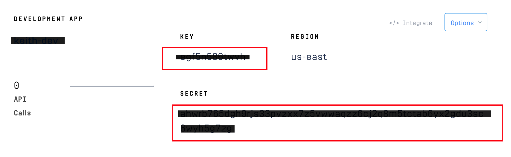
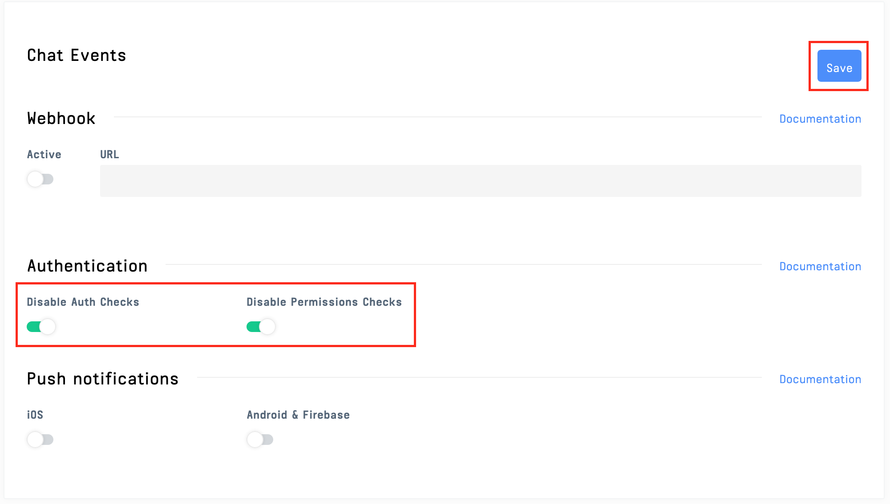

# Save and Send Chat Transcripts with SendGrid

In this tutorial, we'll build a chat app that sends a copy of a chat transcript in an email using SendGrid. Imagine being able to automatically inform your sales team when one of their clients has chatted with your support team. This app sends a transcript of that chat directly to the salesperson's email address using Stream Chat and SendGrid. 


This post will guide you through the [Git Repository Here](https://github.com/isaidspaghetti/stream-sendgrid-transcript). Let's get started!

### What is Stream Chat?

>*Build real-time chat in less time. Rapidly ship in-app messaging with our >highly reliable chat infrastructure. Drive in-app conversion, engagement, and >retention with the Stream Chat messaging platform API & SDKs.*
>- [Stream Chat & Messaging](https://getstream.io/chat/)

## Requirements:

- [node.js](https://docs.npmjs.com/downloading-and-installing-node-js-and-npm)
- [React](https://reactjs.org/docs/getting-started.html)
- A (free) [Stream](https://getstream.io/dashboard/) Trial Account
- A (free) [SendGrid](https://signup.sendgrid.com/) Trial Account
- Some elementary understanding of [React Hooks](https://reactjs.org/docs/hooks-intro.html) and [Express](https://expressjs.com/en/api.html) will also be helpful. 

## Read this tutorial if you want to...

- Learn how to use React useEffect() to collect a chat transcript
- Send a chat transcript in an email using Stream and SendGrid
- Set up a frontend/backend Stream Chat app

These topics will be covered using Express JS and React, but the methodologies can be ported to most languages and frameworks.

## What's not covered

This tutorial focuses on the collection and transmission of a chat transcript. The GitHub repo for this project includes a fully functional registration form and frontend for Stream Chat, but not every aspect will be covered in depth. For more info on the React registration form and initiating a Stream Chat Client, check out [this post](https://getstream.io/blog/how-to-capture-leads-from-live-chat-in-hubspot/).

## Account Configuration

### Stream Setup

Once you've got your free Stream Trial account set up, you'll want to create a new app on your [Stream dashboard](https://getstream.io/dashboard/). Be sure to choose the 'Development' mode.


Copy the API key and Secret generated, we'll add them to a `.env` file in a moment.



By default, Stream offers Auth Checks and Permissions Checks on its apps. These are good features for production apps, but we'll keep this app simple by disabling these. In your Stream dashboard, select your app. Click the 'CHAT' navbar dropdown and select 'Overview'


Scroll down and activate the 'Disable Auth Checks' and 'Disable Permissions Checks' toggles.



### SendGrid Setup 

From your [SendGrid setup guide](https://app.sendgrid.com/guide), you need to verify an email address or domain to send from. We'll just use a personal email address for this app, but be sure not to use a proper domain address in production. Enter the sender details then verify your account with the email sent to the address registered.


Back in the [SendGrid setup guide](https://app.sendgrid.com/guide), select 'Integrate Using Our Web API or SMTP relay,' then select 'Web API'.


Choose `node.js` as the integration language. 


Create a name for your app, generate an API Key, and copy the key for the `backend` `.env` file.


## App Configuration 

### .env Setup

If you're using the git repo, there is a file in the `backend` folder titled `.env.example`. Input your API keys and secret here, then rename the file to `.env`.

<!-- https://gist.github.com/isaidspaghetti/3ef820f9a5641fb87ba8d23073af62e9 -->
```text
//backend/.env
NODE_ENV=development
PORT=8080

STREAM_API_KEY= your Stream API key here
STREAM_API_SECRET= your Stream API secret here
SENDGRID_API_KEY= your SendGrid API key here
```

### SendGrid Configuration

Just a few steps are needed to integrate SendGrid in the `backend`. 
  1. Install the following package:
      ```bash
      npm install --save @sendgrid/mail
      ```
  2. In the `index.js` file, require the SendGrid package: 
      ```javaScript
      const sgMail = require('@sendgrid/mail');
      ```
  3. In `//backend/routes.index.js`, change the `to` and `from` email addresses. The `from` address must be the email address you registered and verified as a sender with SendGrid:
      <!-- https://gist.github.com/isaidspaghetti/774ccdb8bfaff4642c926e3dc4fe26b1 -->
      ```javaScript
      //backend/routes.index.js
        const msg = {
          to: 'recipient@example.com',
          from: 'yourSendGridVerifiedEmail@example.com',
          subject: 'Stream Chat: Your client started a Support Chat Session',
          html: `Hello, \n Your client, ${firstName} ${lastName} started a chat with the support team chat widget on ${createdAt}. \n
          Here is the transcript of the chat: \n ${transcript} END OF TRANSCRIPT \n You can reach your client at ${email}. \n This message was sent to you from Stream Chat`,
        };
      ```

### Initial Run

The app is split into a `frontend` folder created using `stream-chat-react` and a `backend` folder created using `npm express-generator`.

To start the app on your machine run `npm install` and `npm run start` on both `frontend` and `backend` folders. Once running, navigate to `http://localhost:3000` to see the `frontend`. Now, we can dive into how this app works.

## Registration


When a user visits `http://localhost:3000`, they input their credentials which are sent to the `backend` `/customer-login` route. 

The first half of the `register` function sends the form data. The second half receives data from the `backend` to initialize the chat app and join the correct channel. Again, for more depth on this portion, check out [this post](https://getstream.io/blog/how-to-capture-leads-from-live-chat-in-hubspot/).

<!-- https://gist.github.com/isaidspaghetti/afe26e31ab03ef2bb3c41853e46a37f7 -->
```jsx
//frontend/src/App.js:14
const register = async (e) => {
  try {
    e.preventDefault();

    const response = await fetch('http://localhost:8080/customer-login', {
      method: 'POST',
      headers: {
        'Accept': 'application/json',
        'Content-Type': 'application/json',
      },
      body: JSON.stringify({
        firstName,
        lastName,
        email,
      }),
    });

    const { customerId, customerToken, channelId, streamApiKey } = await response.json();
    const chatClient = new StreamChat(streamApiKey);

    await chatClient.setUser(
      {
        id: customerId,
        name: firstName,
      },
      customerToken,
    );

    const channel = chatClient.channel('messaging', channelId);

    setChatClient(chatClient);
    setChannel(channel);

  } catch (e) {
    console.error(e);
  }
};
  ```

The `customer-login` endpoint, found in the `backend API`, cleans the user input, sets up our Stream Chat client, creates a new Stream Chat channel, and sends the information required to join that channel, back to our `frontend`.

<!-- https://gist.github.com/isaidspaghetti/5804b5ef87feb3f76c7428a059ba5494 -->
```javaScript
//backend/routes/index.js:27
router.post('/customer-login', async (req, res) => {
  try {
    const firstName = req.body.firstName.replace(/\s/g, '_');
    const lastName = req.body.lastName.replace(/\s/g, '_');

    const client = new StreamChat(streamApiKey, streamApiSecret);

    [customer, admin] = createUsers(firstName, lastName);

    await client.upsertUsers([
      customer,
      admin
    ]);

    const channel = client.channel('messaging', uuidv4(), {
      members: [customer.id, admin.id],
    });

    const customerToken = client.createToken(customer.id);

    res.status(200).json({
      customerId: customer.id,
      customerToken,
      channelId: channel.id,
      streamApiKey,
    });

  } catch (err) {
    console.error(err);
    res.status(500).json({ error: err.message });
  }
});
```

The `createUsers()` method in the snippet above simply creates the customer and admin objects to be registered with our channel. We used a unique identifier with `uuidv4` as the second argument to `client.channel()`, this is will be the channel id. If a channel id is not included as a parameter, Stream will create one based on the chat participant names. By using a UUID we can be sure that no two 'John Smiths' will end up in the same chat.

<!-- https://gist.github.com/isaidspaghetti/758c053f0f553ed2e8c23ea8f29acf7f -->
```jsx
//backend/routes/index.js:11
function createUsers(firstName, lastName) {
  const customer = {
    id: `${firstName}-${lastName}`.toLowerCase(),
    name: firstName,
    role: 'user',
  };

  const admin = {
    id: 'admin-id',
    name: 'Support Admin',
    role: 'admin'
  };

  return [customer, admin];
}
```

To keep things simple, this app will focus on the `customer` experience of our chat app. The channel creation above assumes a generic `Support Admin` will join the other end of the chat. 

## Chat Window

Once the user has registered, the `chatClient` and `channel` get configured, the following boolean on line 52 allows for the `CustomerChat` component to be loaded: 

<!-- https://gist.github.com/isaidspaghetti/5ee2284dba4775d56a43660a7c1076cb -->
```jsx
//frontend/src/App.js:52
 if (chatClient && channel) {
    return (
      <CustomerChat
        channel={channel}
        chatClient={chatClient}
        firstName={firstName}
        lastName={lastName}
        email={email}
      />);
  }
  ```

The necessary props are sent to the `CustomerChat` component, which returns the following `jsx`: 

<!-- https://gist.github.com/isaidspaghetti/10165379862f4bd0d3fc565cae6d33a2 -->
```jsx
//frontend/src/CustomerChat.js:39
return (
        <div className="App">
            <Chat client={chatClient} theme={'messaging light'}>
                <Channel channel={channel}>
                    <Window>
                        <ChannelHeader />
                        <MessageList />
                        <MessageInput />
                    </Window>
                    <Thread />
                </Channel>
            </Chat>
        </div>
    );
}
```

This is all that's required for Stream to set up an elegant and customizable chat window. Check out [Stream's free UX kits](https://getstream.io/chat/ui-kit/) to add some polish.

## Sending a Chat Transcript to the Backend

Rather than prompting users to send a chat transcript with a button, this app will automatically `POST` the transcript to the backend when the user closes their browser window or tab. This is achieved using the `useEffect()` React Hook. Here's how...

<!-- https://gist.github.com/isaidspaghetti/c93b717f981c6b637b3bce1aa4d31bf2 -->
```jsx
//frontend/src/CustomerChat.js:6
useEffect(() => {
    const handleUnload = (event) => {
        event.preventDefault();
        fetch('http://localhost:8080/email-transcript', {
            method: 'POST',
            headers: {
                'Accept': 'application/json',
                'Content-Type': 'application/json'
            },
            body: JSON.stringify({
                messages: channel.state.messages,
                firstName: firstName,
                lastName: lastName,
                email: email,
                createdAt: channel.data.config.created_at
            })
        });
        event.returnValue = '';
    };

    window.addEventListener('beforeunload', handleUnload);

    return () => {
        window.removeEventListener('beforeunload', handleUnload);
    };
}, [channel, firstName, lastName, email]
);
```

The `useEffect()` above initiates an event listener to listen for `beforeunload` (user closing the browser window), and will run the `handleUnload` function when the event is eventually triggered. 

`handleUnload` initiates a `POST` to the `backend`. All the data needed for a transcript is conveniently bundled in the Stream `channel` object. This object contains loads of useful information, including all messages sent in the channel.

### The Intricacies of useEffect()

  * We limited the triggering of `useEffect()` by including a second argument array: `[channel, firstName, lastName, email]`. `useEffect()` will only be triggered if one of the elements in that array has had its state changed. 

  * The `removeEventListener()` function is an optional cleanup function. React will perform this function when the component unmounts, ensuring there's only one event listener.

  * Note that the `event.returnValue = '';` is a requirement for Chrome's `beforeunload` event listener to work properly.

One of the caveats of using this method is the on-close popup.


If a user is in an hour-long support chat, this is a helpful feature; if you're looking for something different in your production, WebSockets provide a different experience but are outside the scope of this post.

## Receive the Frontend Transcript

The following snippet handles the chat transcript from the `frontend`:

<!-- https://gist.github.com/isaidspaghetti/5e7db61bce38a3d4c364a36d04e4c7b6 -->
```javaScript
//backend/routes/index.js:59
router.post('/email-transcript', async (req, res) => {
  const messages = req.body.messages;
  const { firstName, lastName, email, createdAt } = req.body;

  let transcript = messages.map((message) => {
    return (`<li>FROM: ${message.user.id}</li>\n<li>MESSAGE: ${message.text}</li>\n`);
  });

  sgMail.setApiKey(sendgridApiKey);

  const msg = {
    to: 'recipient@example.com',
    from: 'sendgridVerifiedEmail@example.com',
    subject: 'Stream Chat: Your client started a Support Chat Session',
    html: `Hello, \n Your client, ${firstName} ${lastName} started a chat with the support team chat widget on ${createdAt}. \n
    Here is the transcript of the chat: \n ${transcript} END OF TRANSCRIPT \n You can reach your client at ${email}. \n This message was sent to you from Stream Chat`,
  };

  try {
    sgMail.send(msg);
    res.status(200).end;
  }
  catch{ (err) => console.log(err.response.body); }

});
```

Let's dissect this a bit. First, the `req.body` is destructured to extract the information we need for our transcript. Next, a transcript is assembled in a simple `html` string by `mapping()` over each message. The result will look like this: 


The `message` object provided by Stream contains a plethora of data. The [Stream Documentation](https://getstream.io/chat/docs/query_channels/?language=js) shows all the options you could include in your email transcripts.

Next, we send SendGrid our API Key `sgMail.setApiKey(sendgridApiKey)` and build the `msg` object. Just use any email address you can check in the `to` field for now. The `from` field must match the email address you registered and verified with SendGrid as a sender. Again, feel free to customize the `subject` and `html` fields as desired.

Finally, we use `sgMail.send(email)` in a `try` `catch` block. This is done because errors can otherwise be swallowed in the response from SendGrid. In a couple of seconds, you will receive the email in your inbox! Voila!


## Closing thoughts

Congrats, you're now able to email your chat transcripts! With just a touch of React knowledge, Stream and SendGrid API do the heavy lifting for us. Parouse some of the other posts on the [Stream Blog](https://getstream.io/blog/) to see more of its functionality!